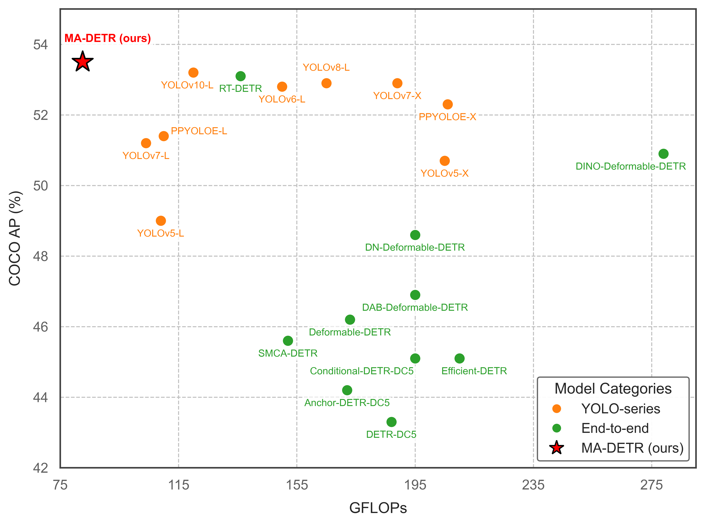
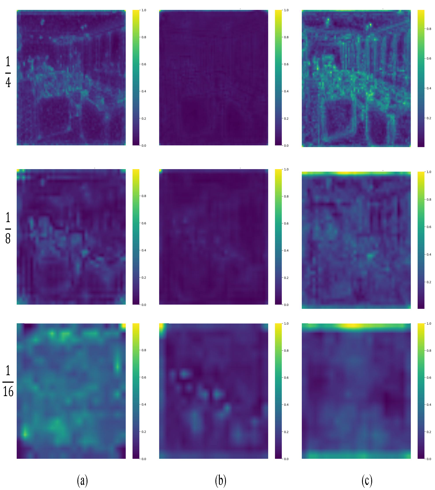
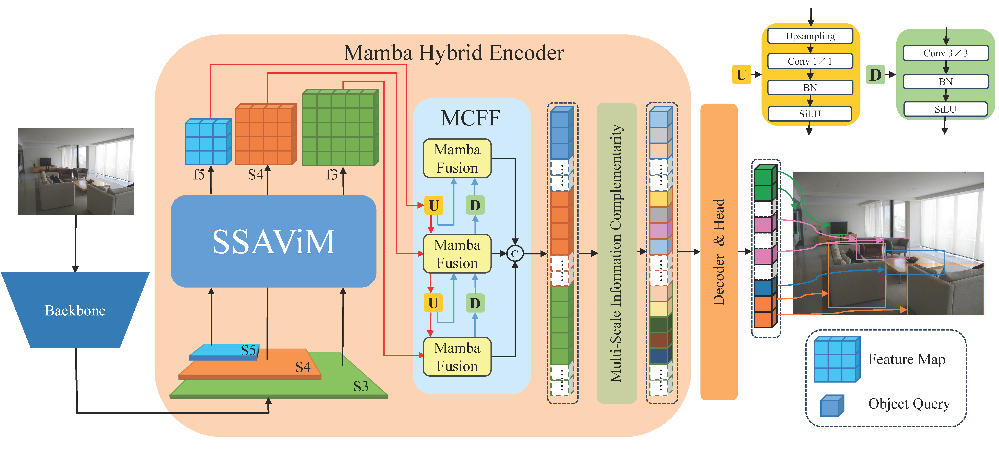

#  MA-DETR: Advancing Object Detection with Spatial-Aware Mamba

Authors: Ke Wang,Peng Zhou,Bohan Li, Feixiang GaoJianbo Lu

## Abstract
Transformer-based frameworks are widely adopted in end-to-end object detection for their robust long-range contextual modeling. However, their quadratic complexity limits efficient processing of long sequences, particularly in scenarios requiring extensive feature interactions. To address this, we propose MA-DETR, a novel architecture that, for the first time, integrates the selective state space model (Mamba) into the Real-Time End-to-End Object Detector framework to enhance feature processing and multi-scale feature fusion within the encoder. First, we introduce the Spatial State Aware Vision Mamba (SSAViM) to replace traditional Transformer modules in the encoder. By incorporating spatial state awareness, multi-scale feature fusion, and spatial decoupling strategies, SSAViM adapts the text-oriented Mamba model to perceive spatial structures, improving spatial alignment and enabling linear-complexity modeling of spatial dependencies. Second, we propose the MambaFusion module, which combines Mamba’s long-sequence modeling with convolutional local feature extraction. Through cross-scale contextual feature fusion, it enriches feature representations, enhancing local region perception and improving small object detection accuracy while maintaining efficient global modeling. Furthermore, we propose the Multi-Scale Information Complementarity (MSIC) operation to mutually enhance local detail features and deep semantic representations. On COCO, MA-DETR achieves 53.5\% AP at 100 FPS (T4 GPU), showcasing real-time potential.
##

## Main Results


*Compared with state-of-the-art end-to-end real-time object detectors under equivalent architectures, our MA-DETR achieves superior performance.*

## Performance

### Attention Heatmap


*Feature heatmaps showcasing attention distribution. (a) Feature heatmap after backbone. (b) Feature heatmap after RT-DETR-R50 encoder. (c) Feature heatmap after MA-DETR (ours) encoder.*

### Detection Performance Comparison


*Red indicates model attention to different image regions. (a) Input image. (b) Detection results after RT-DETR-R50. (c) Detection results after MA-DETR (ours).*

## Architecture


*Network modules for feature enhancement. (a) MambaFusionBlock, integrating convolutional layers and Mamba-based feature fusion. (b) SpatialEnhanceBlock, employing multi-scale convolutions and MLP for spatial feature enhancement.*


## Quick start

<details>
<summary>Install</summary>

```bash
pip install -r requirements.txt
```

</details>


<details>
<summary>Data</summary>

- Download and extract COCO 2017 train and val images.
```
path/to/coco/
  annotations/  # annotation json files
  train2017/    # train images
  val2017/      # val images
```
- Modify config [`img_folder`, `ann_file`](configs/dataset/coco_detection.yml)
</details>


<details>
<summary>Training & Evaluation</summary>

- Training on a Single GPU:

```shell
# training on single-gpu
export CUDA_VISIBLE_DEVICES=0
python tools/train.py -c configs/madetr/madetr_r50vd_coco.yml
```

- Training on Multiple GPUs:

```shell
# train on multi-gpu
export CUDA_VISIBLE_DEVICES=0,1,2,3
torchrun --nproc_per_node=4 tools/train.py -c configs/rtdetr/madetr_r50vd_coco.yml
```

- Evaluation on Multiple GPUs:

```shell
# val on multi-gpu
export CUDA_VISIBLE_DEVICES=0,1,2,3
torchrun --nproc_per_node=4 tools/train.py -c configs/rtdetr/madetr_r50vd_coco.yml -r path/to/checkpoint --test-only
```

</details>

## Model Weights

Pre-trained model weights for MA-DETR are available for download:

- **MA-DETR-R50VD**:
  - Download: [Google Drive](https://drive.google.com/uc?export=download&id=10lG4FdPyZJXIN9CmNwTYU4dItwM_VGjT)
  - Size: 726.7 MB
  - Description: Trained on COCO 2017, achieves 53.5% AP.
